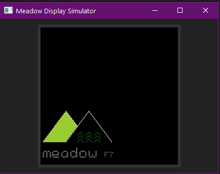

# Meadow Display Simulator
Simulate a display in WPF to test or screen-capture Meadow Graphics Library  apps.

In developing for the Meadow F7 I found taking photos of the SPI LCD Display quite difficult.
Since the Graphics Library only calls a few methods on the display, and is designed to support a large number of displays, 
I found I could write a display driver that would display in windows, using the Meadow Graphics Library as a nuget package.

(note that adding the Meadow nuget package will redefine System, which will cause WPF apps to stop compiling. 
Remove the System reference, and re-add the default to resolve.)

In general - you should be able to copy your MeadowApp.cs, and change the constructor and the display definitions, and run with a minimal number of changes.
The MeadowApp code runs on a background Task. The Show method in the display driver, will call back on the UI thread. You must do the same thing when initializing the driver.

e.g.

```
            App.Current.Dispatcher.Invoke(new Action(() =>
            {
                Initialize((WriteableBitmap)wpfimage.Source);
            }));
```

If you drag the window larger, you can zoom the image for closer inspection.

If you want screenshots saved automatically, just set the display.SnapShotPath to a valid directory, and a timestamped PNG file will be writen each time display.Show() is called.



Of Note: This is now a .net 7 Wpf App (Windows Only) - use of the .net standard meadow nugets is fine.

Software Rendering had to be enabled to get around issues with the Intel Xe Graphics Drivers and WritableBitmaps
